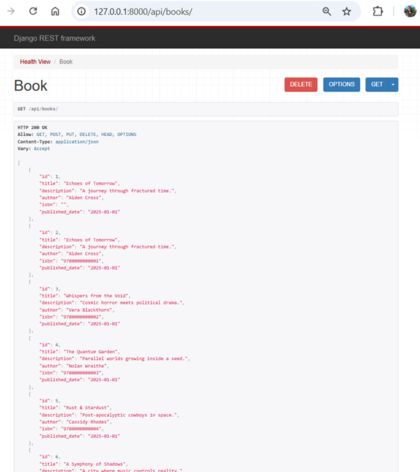
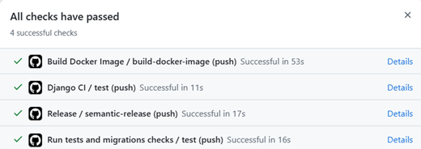
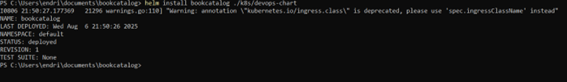
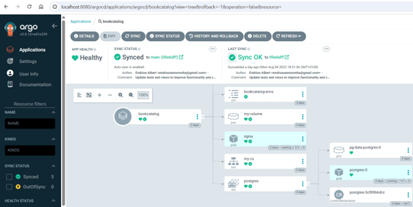

# Book Catalog API – Final DevOps Project

**Author:** Endrius Noronha  
**Date:** August 2025  
**Instructor:** Esteban Garcia

---

## 1. Introduction

This project aims to practically implement the full DevOps cycle, from development to continuous deployment in a Kubernetes environment. The application, called Book Catalog, is a REST API developed with Django, automatically tested, containerized with Docker, integrated into CI/CD pipelines with GitHub Actions, and deployed on Kubernetes with Helm, following modern infrastructure-as-code and GitOps practices via ArgoCD.

---

## 2. Project Overview

Main features:

- Full CRUD API for books  
- PostgreSQL database via Docker  
- CI/CD pipeline with GitHub Actions  
- Containerized using Docker and published to GHCR  
- Deployment with Helm on K3s  
- GitOps using ArgoCD  

---

## 3. Technologies Used

- Python 3.13  
- Django REST Framework  
- PostgreSQL  
- Docker & Docker Compose  
- GitHub Actions (CI/CD)  
- Helm 3  
- Kubernetes (K3s)  
- ArgoCD  
- GHCR (GitHub Container Registry)  

---


## 4. Local Development

**.env file:**

DEVELOPMENT_MODE=true
DATABASE_NAME=books_db
DATABASE_USER=books
DATABASE_PASSWORD=books
DATABASE_HOST=db
DATABASE_PORT=5432

- **docker-compose.yml:**
```yaml
services:
  app:
    build:
      context: .
      dockerfile: ./Dockerfile
    ports:
      - "8000:8000"
    environment:
      DATABASE_NAME: "books_db"
      DATABASE_USER: "books"
      DATABASE_PASSWORD: "books"
      DATABASE_HOST: "db"
      DATABASE_PORT: "5432"
      DEVELOPMENT_MODE: "true"
    depends_on:
      - db
    volumes:
      - ./bookcatalog:/app/bookcatalog

  db:
    image: postgres:17.5
    environment:
      POSTGRES_DB: "books_db"
      POSTGRES_USER: "books"
      POSTGRES_PASSWORD: "books"
    volumes:
      - pg_data:/var/lib/postgresql/data

volumes:
  pg_data:
   ```
   
**Run command:**
- `docker-compose up --build`

## 5. API Overview

**Endpoint:** http://localhost:8000/api/books/

| Method | Path      | Description           |
|--------|-----------|-----------------------|
| GET    | /books/   | List all books        |
| POST   | /books/   | Create a new book     |
| PUT    | /books/   | Update a book by ISBN |
| DELETE | /books/   | Delete a book by ISBN |
| GET    | /         | Health check          |

**Example JSON:**

```json
{
  "title": "Echoes of Tomorrow",
  "description": "A journey through fractured time.",
  "author": "Aiden Cross",
  "isbn": "9780000000001",
  "published_date": "2025-01-01"
}

```
## 6. Django App Overview

**models.py:**

```python
class Book(models.Model):
    title = models.CharField(max_length=200)
    description = models.TextField()
    author = models.CharField(max_length=100)
    isbn = models.CharField(max_length=13, unique=True)
    published_date = models.DateField()

```
- **views.py:**

```python
class BookView(APIView):
    def get(self, request):
        books = Book.objects.all()
        serializer = BookSerializer(books, many=True)
        return Response(serializer.data)

```
## 7. CI/CD with GitHub Actions

- **ci.yml:** runs tests  
- **tests.yml:** runs makemigrations, migrate, pytest  
- **build-docker-image.yml:** builds & pushes image to GHCR  
- **release.yml:** handles versioning and changelog  

You can view the image at:  
https://github.com/users/Endrius-Albert/packages/container/package/bookcatalog

## 8. Kubernetes Deployment

**Helm Chart:** k8s/devops-chart

**Install command:**

- `helm install bookcatalog ./k8s/devops-chart`

**values.yaml:**

```yaml
image:
  repository: ghcr.io/Endrius-Albert/bookcatalog
  tag: latest

ingress:
  enabled: true
  className: nginx
  hosts:
    - host: bookcatalog.local
      paths:
        - path: /
          pathType: Prefix
```
## 9. GitOps with ArgoCD

ArgoCD watches this repository and automatically syncs on changes:

repoURL: https://github.com/Endrius-Albert/bookcatalog
targetRevision: main
path: k8s/devops-chart

## 10. ScreenShots
API running in browser


GitHub Actions workflow


Helm Install


ArgoCD interface


## 11. Final Notes

The application is structured to be automatically tested, packaged in a Docker image, published to a remote repository, deployed with Helm, and managed via GitOps. This workflow reflects not only the technical functioning of a modern system, but also the lessons learned throughout this process.


